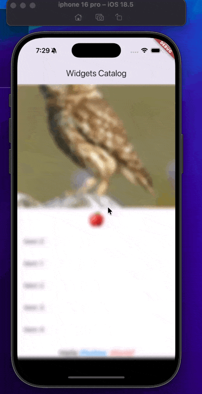

# 📚 Flutter Widgets Catalog – Demonstration App

An interactive **Flutter project** showcasing a wide variety of **Flutter widgets**, animations, input models, and effects.  
This project acts as a **live catalog** where you can see, test, and learn how different widgets behave in real-time.

---

## 📸 Demo Previews

And here’s a quick demonstrations videos GIF:  

### demo


### demo_blur whole page



### demo


---

## 🚀 Features

This catalog demonstrates **a wide range of Flutter widgets**:

- **Accessibility Widgets** → `ExcludeSemantics`, `MergeSemantics`, `Semantics`  
- **Animation & Motion Widgets** → `AlignTransition`, `AnimatedAlign`, `AnimatedBuilder`,  
  `AnimatedContainer`, `AnimatedCrossFade`, `AnimatedList`, `AnimatedOpacity`,  
  `AnimatedPositioned`, `AnimatedSize`, `RotationTransition`, `ScaleTransition`,  
  `SlideTransition`, `SizeTransition`, `DecoratedBoxTransition`, `Hero`, etc.  
- **Implicit & Explicit Animations** → `ImplicitlyAnimatedWidget` with a custom `MyAnimatedColorBox`  
- **Input Widgets** → `Autocomplete`, `KeyboardListener`  
- **Interaction Models** → `AbsorbPointer`, `Dismissible`, `Draggable`, `DragTarget`,  
  `DraggableScrollableSheet`, `IgnorePointer`, `InteractiveViewer`, `LongPressDraggable`  
- **Scrolling Widgets** → `Scrollable`, `CarouselView`, `SliverFadeTransition`  
- **Text Widgets** → `RichText`, `DefaultTextStyleTransition`  
- **Layout Widgets** → `Align`, `AspectRatio`, `IntrinsicHeight`, `IntrinsicWidth`, `Transform`  
- **Painting & Effects** → `BackdropFilter`, `ClipOval`, `CustomPaint` (`CirclePainter`)  

It also includes a **to-do list** powered by a local JSON file (`assets/data.json`) to demonstrate reading and updating data.

---

## 🏗️ Project Structure

widgets_testing/
├── lib/
│   ├── main.dart                 # Entry point – runs WidgetsCatelog
│   ├── home_page.dart            # Main widget demonstrations
│   ├── hero_second_page.dart     # Example of Hero widget with page navigation
│   ├── todo_list_view.dart       # To-do list reading from JSON
│   └── sliver_fade_animation.dart # Sliver + FadeTransition example
├── assets/
│   └── data.json                 # To-do list demo data
├── screenshots/
│   ├── demo.gif                  # Animated demo preview
│   ├── demo1.mp4                 # Demo video 1
│   ├── demo2.mp4                 # Demo video 2
│   └── demo3.mp4                 # Demo video 3
├── pubspec.yaml                  # Dependencies & assets configuration
└── README.md                     # Project documentation

---

## 🛠️ Code Highlights

- **`main.dart`** → App entry point, runs `WidgetsCatelog`.  
- **`home_page.dart`** → Huge widget demonstration area with animations, layouts, input, effects, and interaction models.  
- **`todo_list_view.dart`** → Demonstrates loading tasks from a JSON file (`assets/data.json`) and updating them with checkboxes.  
- **`hero_second_page.dart`** → Demonstrates smooth Hero animations between two pages.  
- **`sliver_fade_animation.dart`** → Shows advanced scrolling with `SliverFadeTransition`.  

---

## 📦 Dependencies

This project uses only **Flutter core libraries** plus:

- `cupertino_icons` for iOS-style icons.  

No extra packages are required.

---

## ▶️ Getting Started

### 1️⃣ Clone the repository

```bash
git clone https://github.com/Riyam224/Widgets-Catalog-Demonstration.git
cd Widgets-Catalog-Demonstration

2️⃣ Install dependencies

flutter pub get

3️⃣ Run the app

flutter run


⸻

📄 JSON File Example

The assets/data.json file contains preloaded tasks for the to-do list demo:

[
  { "id": 1, "task": "Wake up at 7:00 AM", "done": false },
  { "id": 2, "task": "Have a healthy breakfast", "done": false },
  { "id": 3, "task": "Work on Flutter project", "done": false },
  { "id": 4, "task": "Study 2 chapters of a book", "done": false },
  { "id": 5, "task": "Go for a 30 min walk", "done": false },
  { "id": 6, "task": "Call a friend or family member", "done": false },
  { "id": 7, "task": "Prepare dinner", "done": false },
  { "id": 8, "task": "Write down 3 things you learned today", "done": false }
]


⸻

🎯 Learning Outcomes

By exploring this project, you will learn:
 • How to implement Flutter animations (both implicit & explicit).
 • How to use interactive widgets like Dismissible, Draggable, and InteractiveViewer.
 • How to create dynamic UI updates with JSON-powered lists.
 • How to explore scrolling, text, layout, and effects widgets all in one app.

⸻

🤝 Contributing

Feel free to fork this repo and submit pull requests.
Suggestions and widget demonstration ideas are always welcome! 🚀

⸻
